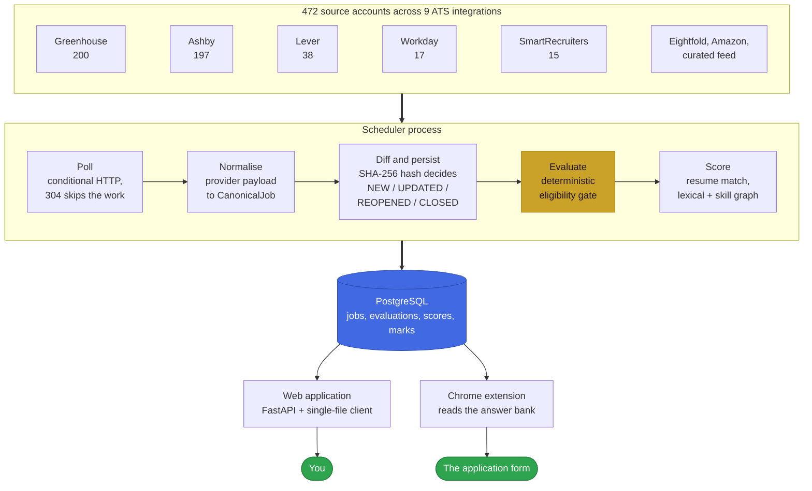
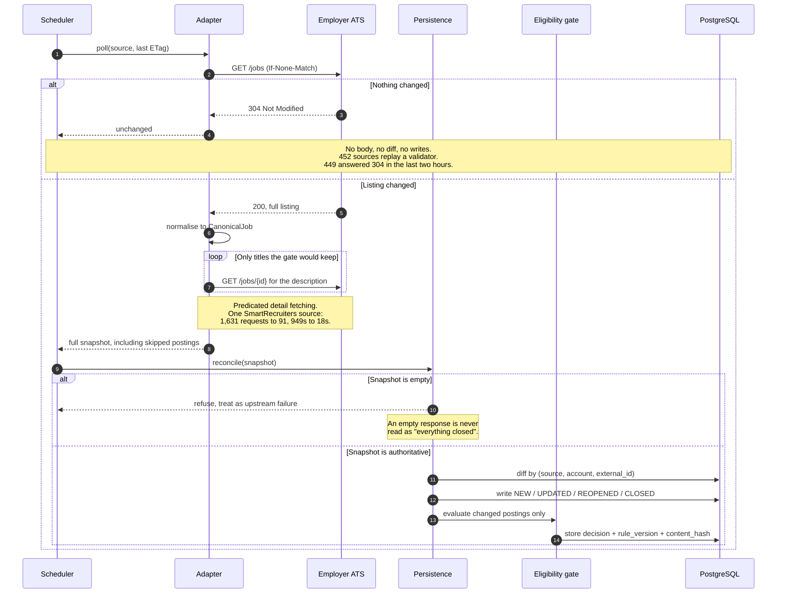
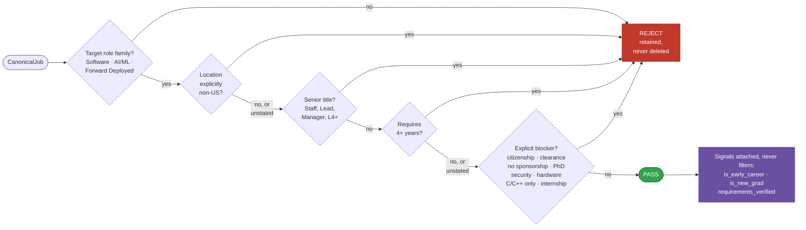
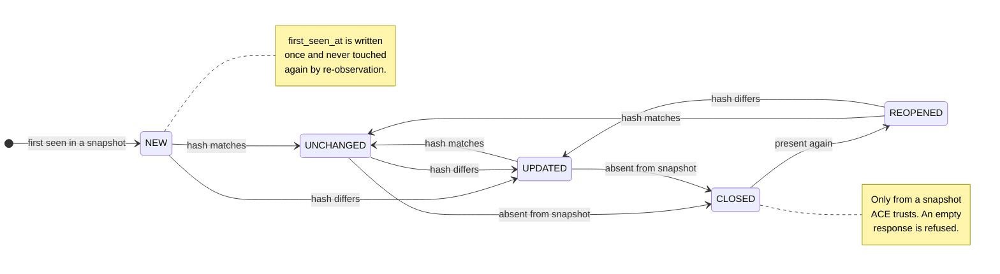
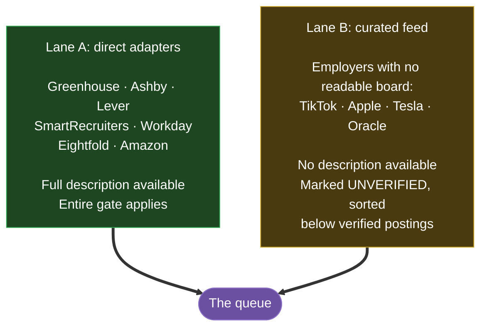
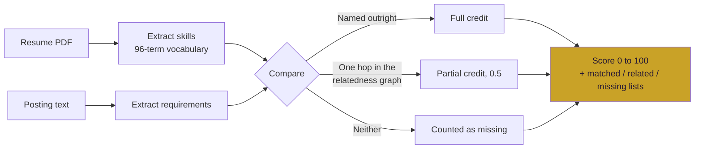
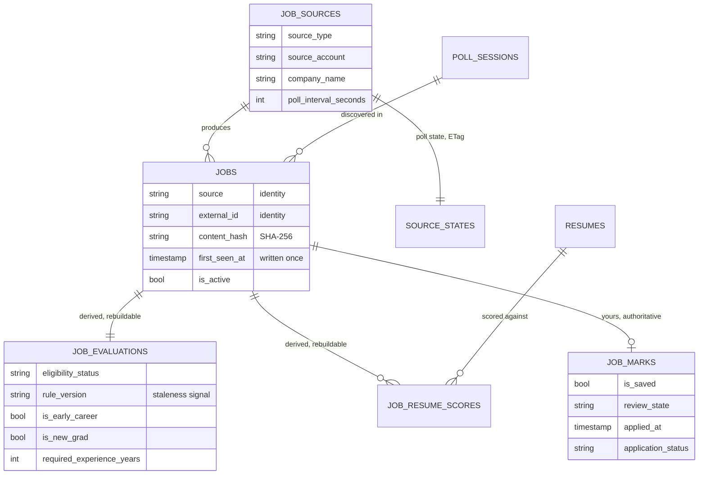
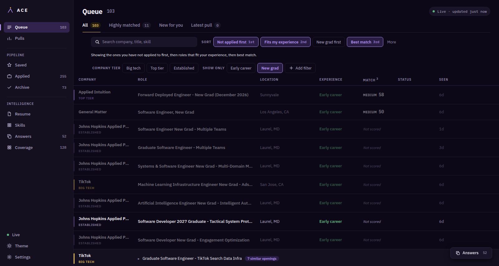
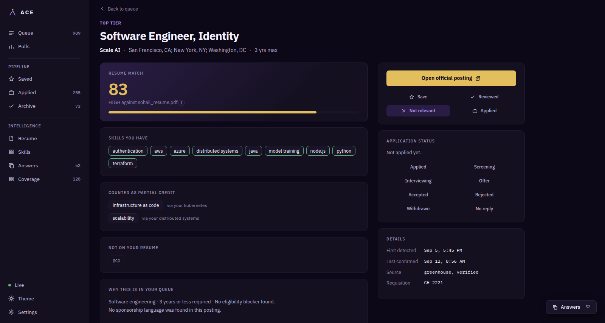
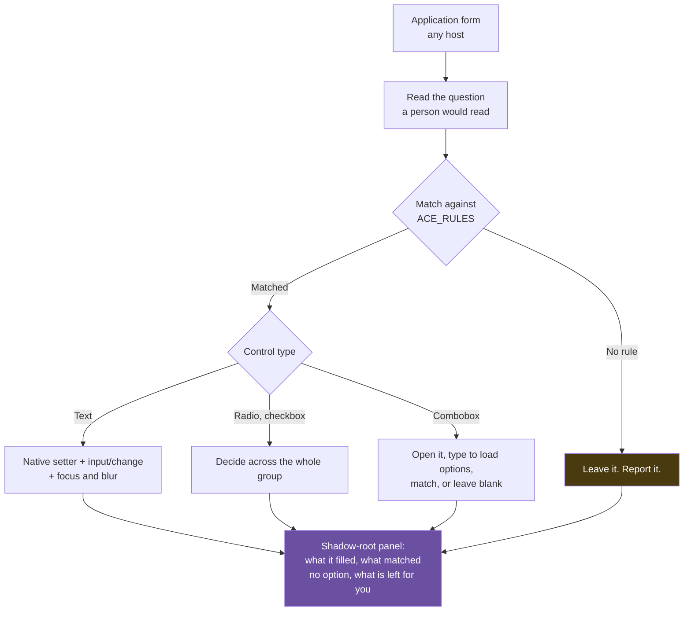

<div align="center">

# ACE

### Automated Career Engine

**A personal career-intelligence pipeline that reads 472 job boards every five minutes, decides what you can actually apply to, and fills in the form when you get there.**

[](https://www.python.org/)
[](https://fastapi.tiangolo.com/)
[](https://www.postgresql.org/)
[](https://www.sqlalchemy.org/)
[](https://docs.docker.com/compose/)
[](#testing)
[](#the-chrome-extension)

</div>

---

## Contents

- [Why this exists](#why-this-exists)
- [At a glance](#at-a-glance)
- [How it works](#how-it-works)
- [Anatomy of a single poll](#anatomy-of-a-single-poll)
- [The eligibility gate](#the-eligibility-gate)
- [Job lifecycle](#job-lifecycle)
- [Where the jobs come from](#where-the-jobs-come-from)
- [Resume matching](#resume-matching)
- [Data model](#data-model)
- [The interface](#the-interface)
- [The Chrome extension](#the-chrome-extension)
- [Principles that shaped the code](#principles-that-shaped-the-code)
- [Getting started](#getting-started)
- [Testing](#testing)
- [Project layout](#project-layout)
- [Status](#status)

---

## Why this exists

Job hunting at scale is mostly an information problem wearing a motivation problem's clothes. The work is not deciding whether to apply. The work is finding the handful of postings worth deciding about, buried under thousands that are senior, out of country, closed, or a duplicate of one seen yesterday.

ACE replaces the loop on the left with the one on the right.

<table>
<tr>
<th align="left" width="50%">By hand</th>
<th align="left" width="50%">With ACE</th>
</tr>
<tr valign="top">
<td>

1. Open a company's careers page
2. Scan for engineering roles
3. Open a posting
4. Check seniority
5. Check location
6. Check years of experience
7. Hunt for sponsorship language
8. Realise it closed last week
9. Repeat, per company, per day

</td>
<td>

1. Open one queue, already ordered by fit
2. Apply

</td>
</tr>
</table>

Everything between those two lists is what this repository contains.

---

## At a glance

| | |
|---|---|
| **Live sources polled** | 472 accounts across 9 ATS integrations |
| **Postings tracked** | 61,711 seen, 56,302 currently open |
| **Employers** | 1,015 |
| **Passing the gate right now** | 989 |
| **Curated target companies** | 411, of which 283 are reachable |
| **Poll cadence** | 5 minutes, 6 sources concurrently |
| **Tests** | 706 Python, 89 matcher cases, real-Chrome browser suite |
| **Continuously running since** | 2026-08-29 |

---

## How it works

Five stages, each with one job and a hard boundary around it. Network I/O never happens inside a database transaction. Eligibility rules never appear inside provider code. The web application never talks to an ATS.



The database is the only thing the two surfaces share. The scheduler is the sole writer of postings and evaluations; the web application writes only what *you* decide, so it can never become a second, divergent account of what exists out there.

---

## Anatomy of a single poll

The interesting engineering is in what ACE avoids doing. A five-minute cadence across 472 sources is roughly 136,000 requests a day, and a naive implementation would download 75 MB per cycle, almost all of it byte-identical to the last one.



Three measures make the cadence sustainable:

| Measure | Effect |
|---|---|
| **Conditional HTTP**, live on 452 sources | An unchanged board returns 304 with no body. The download and the diff are both skipped entirely. |
| **Predicated detail fetching** on Workday, SmartRecruiters and Eightfold | Descriptions are fetched only for titles the real gate would keep. One source went from 1,631 requests to 91, and from 949 seconds to 18. |
| **Bounded concurrency**, 6 sources at a time | One slow employer stops blocking every source queued behind it. The cap is a politeness limit, not a throughput target. |

A stale validator is the one failure this design cannot notice on its own, because silence produces no error. Every source is therefore fetched unconditionally at least once every six hours, which bounds how long a bad ETag can hide real changes.

---

## The eligibility gate

The gate is a pure function: no clock reads, no network, no randomness. That is what makes the entire 61,711-posting corpus re-evaluable after a rule change, and it is why decisions are cached with the `rule_version` that produced them.

Its governing principle is that **silence is not rejection**. Only an explicit blocker rejects. This is not a philosophical preference, it is measured: of 437 sampled postings, exactly 3 stated sponsorship availability positively. A gate requiring proof of sponsorship would return an empty list forever.



Everything after `PASS` is **signal, not exclusion**. Early-career and new-grad flags order the queue; they never remove a posting from it. A terse startup posting that states no experience bar at all is frequently open to a new graduate, so excluding it would cost real opportunities to gain a tidier list.

Two flags exist where one would be simpler, because they answer different questions:

| Flag | Set by | Live count |
|---|---|---|
| `is_early_career` | New grad, junior, associate, entry level, rotational, "Engineer I", or 2 years or fewer | 388 |
| `is_new_grad` | Title alone: new grad, recent graduate, university hire, campus, graduate programme | 103 |

---

## Job lifecycle

Identity is `(source, source_account, external_id)` and never changes. Content is a SHA-256 hash of the normalised posting. Separating the two is what makes a retitled posting an `UPDATED` rather than a new job plus a false closure.



Nothing is ever deleted. A rejected posting is retained in full so that a rule change can be replayed across history, which is exactly what happens: bumping `ELIGIBILITY_RULE_VERSION` and re-running the backfill re-evaluated 50,795 stored postings in a single pass.

---

## Where the jobs come from

Direct polling only reaches an employer if ACE has an adapter for their board. Two lanes close the gap, and they are deliberately unequal in confidence.



**Lane B is browse-only, and that is a finding rather than a shortcut.** Tesla answers automated requests with 403. Apple and TikTok render their listings inside the browser, so the HTML a server returns contains no posting text to read. Apple's own API replies to automation with bot-protection responses, and working around an access control was rejected as an approach, so Apple is covered through the public curated feed instead.

### Coverage, measured honestly

ACE owns its target list rather than inheriting it from community-maintained files, because that made recall a function of whoever last edited someone else's README. The curated list holds 411 companies. Every one that cannot be reached is recorded with the reason:

| Outcome | Companies | Meaning |
|---|---|---|
| Reachable | 283 | Board found, verified, and polling |
| `no_board_found` | 94 | Careers page renders client-side; needs a headless render step |
| `site_unreachable` | 18 | Nothing answers for the name |
| `other_ats` | 10 | Hires through an ATS with no adapter yet |
| `no_postings` | 5 | Readable board, nothing open today |
| `refused` | 1 | Name resolves to a different company |

Verification is a floor, not a formality. A board is only registered if its own metadata or page text confirms the employer, because two companies can share a name and a wrong subscription fills the queue with somebody else's jobs under a name you recognise, which is harder to notice than a gap. An audit of 26 proposed boards caught four wrong ones that had passed every automated check.

---

## Resume matching

Matching is lexical over a curated 96-skill vocabulary with an alias table, chosen over embeddings deliberately: it is explainable, deterministic, and free. A ranking that cannot tell you *why* it ranked something is not actionable when the output is "spend an hour writing a cover letter".



`RELATED_SKILL_PAIRS` is a hand-curated graph of 79 pairs, read **one hop only**. Transitivity would make pandas evidence of FastAPI by way of Python. Four properties keep partial credit honest, each pinned by a test:

- Matched and related lists are disjoint, so one requirement cannot be credited twice.
- Adjacency never outranks naming the skill outright.
- The graph is symmetric and validated at import: a pair naming an unknown skill raises rather than silently never matching.
- Re-scoring re-extracts resume skills from stored raw text, because a resume parsed under an older vocabulary under-reports what it evidences.

Scores carry an `algorithm_version` for the same reason evaluations carry a `rule_version`: derived data with no staleness signal looks authoritative forever.

---

## Data model



The division that matters is **derived versus authoritative**. `job_evaluations` and `job_resume_scores` can be dropped and rebuilt from `jobs` plus the rules at any time. `job_marks` cannot: saved, reviewed, dismissed and applied are entered by hand, so a re-score must never touch them.

```bash
# Report what has gone stale, write nothing
python -m backend.scripts.backfill_job_evaluations

# Rebuild it
python -m backend.scripts.backfill_job_evaluations --apply
```

---

## The interface

One surface, built as a triage instrument rather than a dashboard. A queue implies an end, and a finishable list is the point.

<div align="center">

<br/><em>The queue. Sorts combine and say what they do in words; filters narrow without hiding.</em>
</div>

<br/>

<div align="center">

<br/><em>Every score is explainable: what matched, what earned partial credit and why, what is missing, and the reason the posting passed the gate.</em>
</div>

A few decisions worth calling out, because each one replaced something that was quietly wrong:

- **Unscored is a designed state, not an absence.** Postings ACE could never read say "Not scored, description unavailable" against a dotted rail. Rendering that as `0` or a dash would read as "bad match", which is a lie about what the system knows.
- **Experience fit appears on every row** in one of three honest states: labelled early career, an extracted ceiling such as "3 yrs max", or "Experience not stated". The last must read as neutral, because unlabelled roles are deliberately kept.
- **Filters exclude as well as include.** "Every big-tech early-career role except Amazon's" is a real question, and it needs both halves.
- **Facet counts are taken inside the active filters**, so a number in the menu is the number of rows choosing it will show. A filter promising 69 results and delivering an empty screen is indistinguishable from a broken tap.

---

## The Chrome extension

A Manifest V3 extension that fills application forms from an answer bank stored in your local ACE instance. It fills and stops: it never submits, and it never overwrites a field that already has a value.



Every rule in the matcher was written blind, failed against a real form, and was corrected. Testing against fixtures would have shipped all of them. A sample of what live forms taught it:

| Lesson | The bug it fixed |
|---|---|
| Match the **question text**, never the `name` attribute | Those are generated per tenant and carry nothing |
| A radio's own label is the **option**, not the question | A "LinkedIn" option in "how did you hear about us" was ticked by a stored profile URL |
| Whole words, with an optional plural | "ethnicity" contains "city", so a stored city was typed into an ethnicity question |
| A checkbox reports `value` of `"on"` whether ticked or not | 19 empty fields on one form were reported as already filled |
| Read the field's **own** dropdown, never the first on the page | A permanently-mounted phone country list of 244 options was answering every question on the form |
| Verify your own writes survived | Choosing a country made the phone widget wipe the number ACE had just typed |

The matcher's rules are pinned by 89 cases, **half of which are questions that must stay empty**, because a wrong answer on a form about to reach an employer is worse than a blank one.

---

## Principles that shaped the code

These are not aspirations. Each one exists because violating it caused a real, traced failure.

> **1. The gate decides inclusion. Nothing else does.**
> Freshness, verification status and match score affect ordering and alerting only. No score may hide a qualifying job.

> **2. Silence is not rejection.**
> Missing sponsorship, experience or location information is *unknown*, never disqualifying.

> **3. Identity and content are separate.**
> A retitled posting is an update, not a death and a birth.

> **4. Never mass-close from one bad response.**
> An empty snapshot is refused as authoritative. Nine pages of a twenty-page walk would mark hundreds of live jobs closed.

> **5. Evaluation is reproducible.**
> No wall-clock reads, no network, no randomness inside the gate.

> **6. The apply link is always the employer's own posting.**
> Never an aggregator, never a redirect. An aggregator lane was built and then removed for failing exactly this test.

> **7. Store everything, show little.**
> Rejected postings are retained so a rule change can be replayed over history.

---

## Getting started

**Requirements:** Docker, Docker Compose, and Python 3.12 if you want to run the tests outside a container.

```bash
git clone https://github.com/anwarbuilds/ace.git
cd ace
cp .env.example .env          # then edit it

docker compose up -d          # postgres, migrations, scheduler, web
```

The web application is then on **http://localhost:8000**, and PostgreSQL is on host port **5433** to stay out of a local install's way.

```bash
docker compose ps             # scheduler reports healthy once it has polled
docker compose logs -f scheduler
```

> [!IMPORTANT]
> `docker compose build` on its own restarts nothing. After a build, run
> `docker compose up -d --force-recreate <service>` or the container keeps
> serving the old image. The `migrate` service has its own image off the same
> Dockerfile, so rebuilding only `web` leaves migrations on disk unapplied.

**Loading the extension:** open `chrome://extensions`, enable Developer mode, choose **Load unpacked**, and select the `extension/` folder. Reloading the extension does not reload the content script in tabs that are already open; reload the tab, or use **Fill this page** from the toolbar popup, which injects on demand.

---

## Testing

```bash
python -m pytest backend/tests -q        # 706 tests, about 40 seconds
python -m pytest backend/tests -m browser # real Chrome, over DevTools protocol
cd extension && node test-rules.js        # 89 matcher cases
```

The browser suite drives a real Chrome instance against a running ACE, and skips rather than fails when Chrome or the server is absent, so a plain checkout stays green.

It exists because every interface bug in this project's history was found by a person looking at the page, never by the unit tests: a primary action pushed below the fold, a list stuck on skeletons, a sort that silently did nothing, and a deletion that removed unrelated functions and left the app blank. Each browser test covers a defect that actually shipped.

Two rules the suite enforces on itself, both learned the hard way:

- **Assert on the server, not the DOM, for anything that persists.** Waiting on rendered text confirms a click was handled, not that the write completed.
- **Confirm a new test fails against the bug it describes.** A test written for a fixed bug once passed against the reintroduced bug, and only a deliberate mutation run caught it.

---

## Project layout

```
backend/
  app/
    adapters/       Provider-specific fetch to CanonicalJob. No eligibility knowledge.
    runners/        Composition: injects gate-derived predicates into adapters
    scheduling/     Cadence, dispatch, one transaction per poll
    persistence/    Lifecycle diff and content hashing. Never commits; callers own transactions
    intelligence/   The eligibility gate and role classifier. Pure functions
    evaluation/     Applies gate and freshness to a snapshot
    matching/       Resume parsing, skill extraction, scoring
    discovery/      Finds new ATS accounts from public sources
    coverage/       The owned company list and the recall benchmark
    applications/   Reads a tracker sheet, matches rows to stored postings
    answers/        What each application question is, and the wordings forms use
    api/            FastAPI + a single-file vanilla-JS client
  tests/            706 tests, including a real-Chrome browser suite
  migrations/       Alembic, currently at 0028

extension/          Manifest V3 autofill. fields.js is pure matching logic and
                    is unit-tested standalone; content.js touches the DOM

docs/
  ACE-KNOWLEDGE.md  Why the system is the way it is. Read first.
  overview.md       Architecture and module map
  learning-log.md   Implementation history and trade-offs
```

---

## Status

Running continuously against live employer boards since **2026-08-29**.

| Capability | State |
|---|---|
| Continuous polling, 472 sources | Shipped |
| Deterministic eligibility gate, rule `v29` | Shipped |
| Lifecycle diffing and re-evaluation | Shipped |
| Resume matching with partial credit | Shipped |
| Web application and triage queue | Shipped |
| Application tracking, import and export | Shipped |
| Chrome autofill extension | Shipped |
| Coverage benchmark and board discovery | Shipped |
| Production deployment, auth, backups | Planned |
| Mobile client | Future |

**Known limits, stated plainly:** Google and Meta render their boards client-side with no structured data and are not covered. Microsoft is blocked by a certificate hostname mismatch on their own careers API, and disabling verification to work around it was refused. 94 curated companies need a headless render step in discovery before they can be reached, which is new surface area in the scheduler path and has not been built.

---

<div align="center">
<sub>Built by <a href="https://github.com/anwarbuilds">@anwarbuilds</a></sub>
</div>
